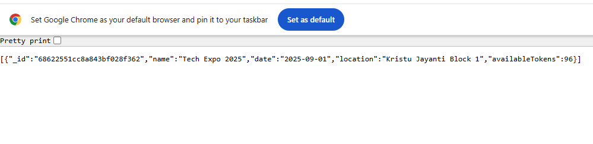
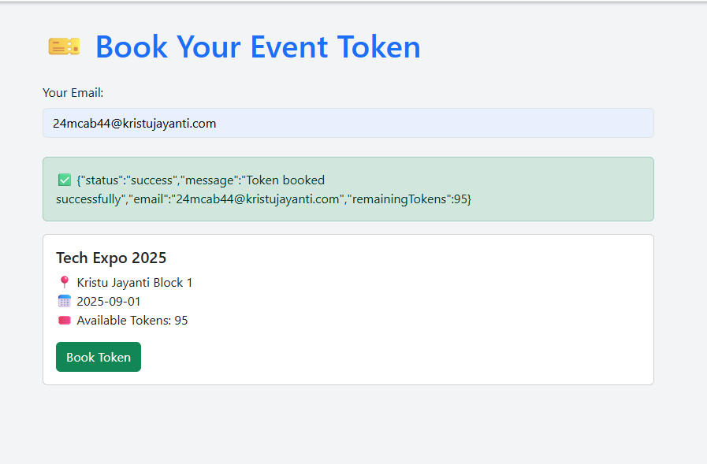

# 🎟️ Event Ticket Token System (Java + Vert.x + MongoDB)

A complete web-based application built using **Java**, **Vert.x**, and **MongoDB**, with a clean **HTML + Bootstrap frontend** to browse events and book tokens. It includes email notifications for user registration and successful bookings using **SMTP**.

---

## 🚀 Features

- ✅ User Registration with auto-generated secure password
- ✅ User Login authentication via email/password
- ✅ View list of upcoming events with available token counts
- ✅ Book a token for an event (decreases availability)
- ✅ Unique alphanumeric token generation
- ✅ Email confirmations for registration & booking
- ✅ RESTful API design with Vert.x
- ✅ Frontend integrated using HTML, JS, Bootstrap
- ✅ SMTP integration for sending emails

---

## 🖼️ Screenshot

> UI when events are listed and token is booked:
> 

  

## 🛠️ Tech Stack

| Layer     | Technology                        |
|-----------|------------------------------------|
| Frontend  | HTML, JavaScript, Bootstrap        |
| Backend   | Java 17, Vert.x Core + Web         |
| Database  | MongoDB                            |
| Email     | Jakarta Mail (SMTP - Gmail/AppPass)|
| Tools     | Postman, IntelliJ, GitHub          |

---

## 📁 Project Structure

src/
└── main/
└── java/
└── org/example/eventsystem/
├── MainVerticle.java
├── controller/
│ ├── AuthController.java
│ ├── EventController.java
│ └── BookingController.java
├── service/
│ ├── AuthService.java
│ ├── EventService.java
│ └── BookingService.java
├── util/
│ ├── EmailUtil.java
│ ├── PasswordUtil.java
│ ├── TokenUtil.java
│ └── ConfigLoader.java
└── model/
├── User.java
├── Event.java
└── Booking.java
frontend/
└── index.html

---

## 📬 API Endpoints

| Method | Endpoint         | Description                                 |
|--------|------------------|---------------------------------------------|
| POST   | `/register`      | Register user, generate password, send email|
| POST   | `/login`         | Authenticate user credentials               |
| POST   | `/addEvent`      | Add a new event                             |
| GET    | `/events`        | List all events                             |
| POST   | `/bookings`      | Book a token for an event via email + ID    |

---

## 📧 SMTP Setup

In `EmailUtil.java`, set your SMTP credentials:
String username = "your-email@gmail.com";
String password = "your-app-password";
📌 Tip: Use a Gmail App Password or Mailtrap for development.

💻 Running the Project
Clone the Repository
git clone https://github.com/Praveena23-2003/Day11_EventTicketSystem.git
cd Event-Ticket-Token-System
Set MongoDB Connection

Configure in ConfigLoader.java as:
config.put("connection_string", "mongodb://localhost:27017");
config.put("db_name", "eventsystem");
Build and Run

mvn clean install
java -cp target/classes org.example.eventsystem.MainVerticle
Run Frontend

Open frontend/index.html in your browser (via Live Server or localhost).

Backend must run on port 9090 (configured in MainVerticle).

🧪 API Testing (Optional via Postman)
http
Copy
Edit
POST /register
{
  "name": "Praveena",
  "email": "24mcab44@kristujayanti.com"
}

POST /login
{
  "email": "24mcab44@kristujayanti.com",
  "password": "autoGeneratedPassword"
}

POST /addEvent
{
  "name": "Tech Expo 2025",
  "date": "2025-09-01",
  "location": "Kristu Jayanti Block 1",
  "availableTokens": 100
}

GET /events

POST /bookings
{
  "email": "24mcab44@kristujayanti.com",
  "eventId": "eventObjectId"
}

✨ Author
Praveena R
📍 Kristu Jayanti College
🎓 MCA Student – Passionate about building full-stack real-world apps

🔗 GitHub: @Praveena23-2003